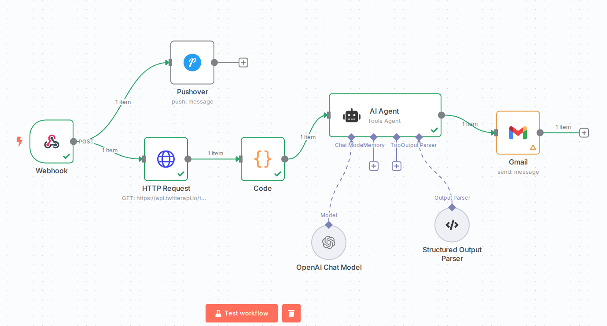

# Oref GPT: AI Workflow For Immediate Info About Red Alerts In Israel (Social Media)


[](https://n8n.io/)
[](#)
[](https://www.home-assistant.io/)


> ⚠️ **IMPORTANT WARNING**: This tool is provided for informational purposes only and should NOT be relied upon as a primary source for emergency preparedness or response. Always prioritize official government resources and emergency services for critical safety information. This is intended as a supplementary resource only.

## Workflow Model



## Overview


Oref-GPT is an n8n automation workflow designed to process Red Alert notifications from Home Assistant and generate real-time situation reports during missile alerts in Israel. The system consists of two main workflow chains:

1. **Alert Notification Chain**: Receives webhook triggers from Home Assistant's Red Alert RF integration and sends immediate notifications via Pushover.

2. **Situation Report Chain**: Gathers real-time information about missile launches by querying Twitter API, processes the data, passes it to an AI agent for analysis, and distributes detailed situation reports via Twitter and email.

## How It Works

### Trigger
- The automation is triggered by webhook calls sent from Home Assistant with the Red Alert RF integration
- When a missile alert is detected, Home Assistant sends detailed alert data to the n8n workflow

### Processing Flow

#### Alert Chain
- Receives incoming webhook data from Home Assistant
- Extracts alert information (location, time, threat type)
- Formats and sends immediate notifications via Pushover

#### Situation Report Chain
- Queries Twitter API for real-time information about the missile launch
- Processes and reformats the Twitter data using transformation scripts
- Passes the formatted data to an AI agent for analysis and context generation
- Creates a comprehensive situation report with threat assessment
- Distributes the situation report through multiple channels:
  - Twitter updates
  - Email notifications

## Configuration

The workflow requires configuration of the following services:

- Home Assistant with Red Alert RF integration
- Pushover for immediate notifications
- Twitter API for data gathering and posting updates
- Email service for situation report distribution
- AI service for analysis and report generation

## Files

- `automation/workflow.json`: The main n8n workflow definition
- `scripts/transform.js`: JavaScript transformation for processing Twitter API data
- `prompts/`: Contains AI agent prompts for situation analysis

## Code Samples

### Webhook Configuration (n8n)

```json
{
  "parameters": {
    "httpMethod": "POST",
    "path": "incoming-alert",
    "options": {}
  },
  "type": "n8n-nodes-base.webhook",
  "name": "Webhook"
}
```

### Twitter Data Transformation Script

```javascript
// Grab the first input item (assuming your input has one item with a "tweets" array)
const allTweets = items[0].json.tweets.slice(0, 20); // top 20 tweets only

// Map and format them into a readable string
const formatted = allTweets.map(tweet => {
  const author = tweet.author?.userName || "unknown";
  const time = tweet.createdAt || "unknown time";
  const url = tweet.url || "";
  const text = tweet.text.replace(/\n/g, ' '); // clean up newlines
  return `@${author} at ${time}:\n"${text}"\n${url}`;
});

// Join all into one string
const combinedText = formatted.join("\n\n");

return [{
  json: {
    combined_text: combinedText
  }
}];
```

### AI System Prompt Example

```markdown
You are a helpful assistant whose task is to help the user to gain quick situational awareness into the cause of missile fire and security events at various locations in Israel. You will receive a prompt from the user specifying the specific location in Israel where a red alert has been received. Upon receiving this input, your task is to search social media and other breaking news sources in order to find initial information as to the source of the rocket fire (or other alert type).
```

## Setup

To use this automation:

1. Import the workflow.json into your n8n instance
2. Configure the required API credentials for Twitter, Pushover, and email services
3. Set up the webhook endpoint in Home Assistant's Red Alert integration
4. Test the workflow to ensure proper operation

## Security Note

This workflow handles sensitive alert information. 

Ensure all API keys and credentials are properly secured and that data transmission is encrypted.

## Disclaimer

**This tool is NOT a replacement for official emergency alerts or government resources.** It is designed as a supplementary information source that attempts to provide context about security incidents after they have been officially reported. Always follow official guidance from:

- [Home Front Command (Pikud HaOref)](https://www.oref.org.il/)
- Local emergency services
- Government emergency broadcasts

The reliability of information gathered from social media sources cannot be guaranteed, especially during emergency situations. Use this tool responsibly and always prioritize official channels for critical safety decisions.
